# EdgeRandomForest
This is an implementation of the paper *Dollár, P. and Zitnick, C.L., 2014. Fast edge detection using structured forests. IEEE transactions on pattern analysis and machine intelligence, 37(8), pp.1558-1570.*.

The most simple way to test the code is running the code RandomForest.py directly. Make sure that you have downloaded the data and keep the path of the data in the RandomForest.py correctly. Please modify the code accordingly.

By running the code, a random forest with max_depth 64 and 1000 training data for each decision tree will be build. The test images will be tested and shown automatically after the training. The model will be saved to the model.txt after training.

### Data input:
```python
from data import BSDS500
data = BSDS500('PathToYourData/BSDS500/data/')
```

### Build and train the model with data (Note that the data must be the class BSDC500):
```python
from RandomForest import RandomForest
rf = RandomForest()
rf.build_data(data,50)
```

### Build a model from the file:
```python
rf.build_from_file('model_10000.txt')
```
### Prediction
With a model, we can predict the edge of the image:
```python
img = cv2.imread("image.jpg")
rf.predict(img,visualization = True)
```
The default predicting stride is 16 (to accelerate the prediction), however, 2 is recommended in the paper. It may take a while for the model to predict the edge with a small stride. To get a better result, you can modify the stride
```python
rf.stride = 2
```
The argument visualization is set False by default. If True, the predicted edge image and the original image would be shown by using ```cv2.imshow``` and ```cv2.WaitKey()```


The detail about the data class BSCD500 can refer to the file data.py. The data can be downloaded from the [Berkeley Vision Group](https://www2.eecs.berkeley.edu/Research/Projects/CS/vision/grouping/resources.html)

Below are some results of the algorithm with a stride 4:

Original image             |  Edge Detection
:-------------------------:|:-------------------------:
  |  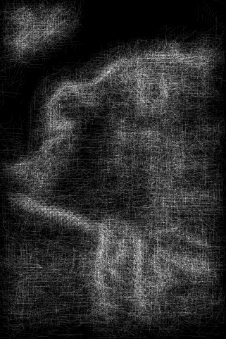|
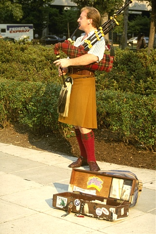  |  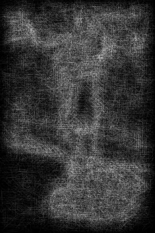|
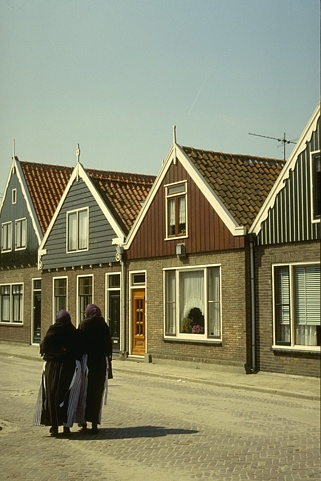  |  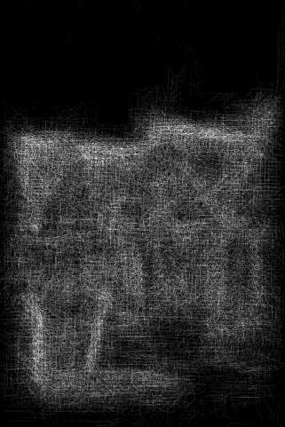
  |  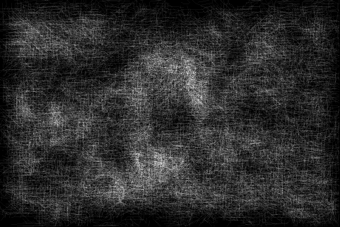
  |  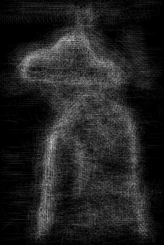
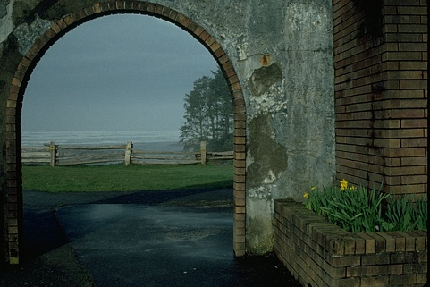  |  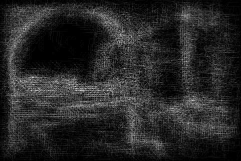
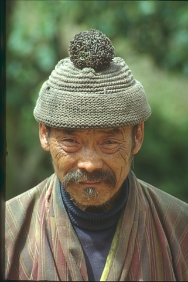  |  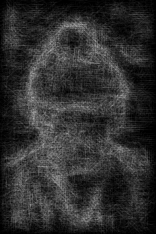
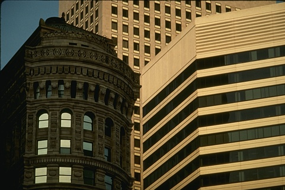  |  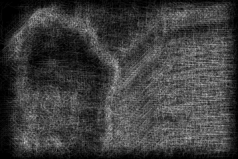
  |  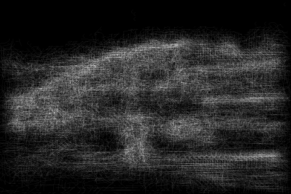
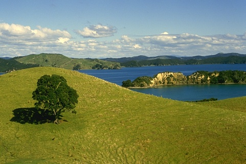  |  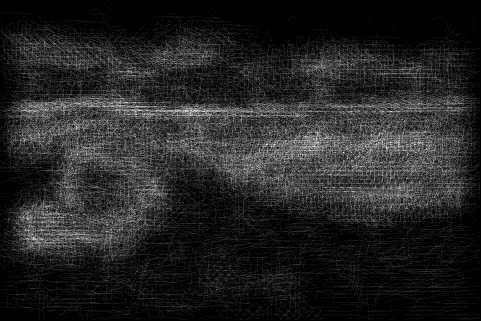
  |  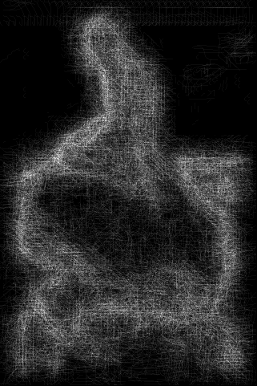
  |  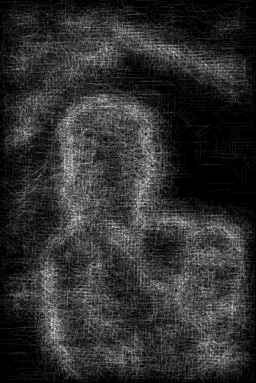